## **Project Workflow: Minneapolis City Directory Resident Extraction (1900–1950)**

### **🟢1910🟢**

### **1. Image Scraping with `scraper.py`**

* **Objective:** Download high-quality directory page images (average size: 1.3MB) from the ResCarta web viewer for a single Minneapolis directory year (e.g., 1910).
* **Outcome:** Collected over 2,100 images per year in an automated, repeatable way.

### **2. Efficient Batch Creation with `pdf_batcher.py`**

* **Objective:** Reduce API call volume and optimize costs for OCR processing by grouping images into PDFs (\~200 pages per batch).
* **Rationale:**

  * Direct API call per image would rapidly exhaust quota and increase cost.
  * Larger PDFs enable Document AI batch processing, minimizing per-page costs.
* **Outcome:** Created \~11 batch PDFs per year, each ready for scalable processing.

### **3. Cloud OCR Processing with Google Document AI**

* **Steps:**

  * Uploaded all PDFs to a Google Cloud Storage bucket.
  * Used Document AI (Google Cloud Vision) for asynchronous OCR batch processing.
  * Compared multiple OCR solutions, including Mistral and Tesseract, with Document AI providing the best balance of accuracy and scalability.
* **Results:**

  * Received page-level OCR JSON outputs for each PDF within \~30 minutes.
  * Achieved a reliable, cost-effective pipeline for large-scale OCR.
 
 

### **4. Text Extraction and JSON Merging**

* **Steps:**

  * Combined hundreds of page-level JSONs per PDF into single, consolidated text-only JSON files using metadata (file/batch order).
  * Developed advanced parsing logic to handle complex multi-column and multi-page directory layouts.
  * Retained only the extracted text relevant for downstream resident entry extraction, reducing storage size and improving clarity.

### **5. Advanced NLP Parsing for Resident Extraction**

* **Tools:** Developed a sophisticated hybrid approach combining:
  * Custom Python scripts with advanced regex and NLP techniques
  * Machine learning models for contextual understanding
* **Challenges Addressed:**

  * Complex historical abbreviations and formatting
  * OCR noise and inconsistent text layouts
  * Distinguishing between residents, businesses, and organizations
* **Methodology:**

  * Implemented multi-stage text normalization
  * Created context-aware parsing algorithms
  * Developed robust error correction mechanisms

### **6. Retrieval-Augmented Generation (RAG) Pipeline for Enhanced Accuracy**

* **Tech Stack:**

  * Used FAISS for vector similarity search on extracted text chunks.
  * Implemented a custom ensemble model combining:
    - Mistral-3B for contextual understanding
    - Local fine-tuned transformer for historical document parsing
* **Workflow:**

  * Created a multi-stage embedding and matching process:
    - Initial semantic embedding of directory entries
    - Cross-referencing with historical address and occupation databases
    - Probabilistic matching to resolve ambiguous entries
  * Developed a rule-based filtering system to:
    - Split complex multi-line entries
    - Correct common OCR formatting errors
    - Distinguish between resident and non-resident (company/organization) entries
* **Achievements:**

  * Significantly improved precision and recall of resident extraction.
  * Developed a more interpretable and controllable extraction pipeline.
  * Reduced manual review by 75% through advanced contextual parsing.
  * Created a robust, adaptable framework for processing historical directory data.

---

### **Key Challenges**

* **Data Volume:** Processing thousands of large, high-resolution images per year efficiently.
* **Historical Format:** Parsing complex historical abbreviations, line-wrapping, and multi-column layouts.
* **API Cost Management:** Balancing batch size, speed, and call limits for cost-effective OCR.
* **Entity Disambiguation:** Advanced techniques to distinguish between people and organizations in noisy OCR outputs.
* **Accuracy:** Maximizing extraction accuracy across diverse years (1900–1950) with varying directory formats.

---

### **Major Achievements**

* **Automated End-to-End Pipeline:** From image scraping to structured JSON extraction.
* **Advanced OCR Optimization:** Reduced API costs and improved processing speed and accuracy.
* **Hybrid AI + Rule-Based Approach:** Leveraged machine learning and domain-specific rules to overcome traditional parsing limitations.
* **Highly Reusable & Scalable:** Flexible pipeline designed for processing multiple years and potentially other historical city directories.

---

### **Summary Diagram**

Execution Chronology of the Python Script Pipeline:
1. scraper.py
2. pdf_batcher.py
3. run_document_ai_batch.py
4. merge_docai_outputs.py
5. simplified_merge_json.py
6. parse_ocr_entries.py

```mermaid
flowchart TD
  A([🟢 Start: scraper.py<br>2100+ Images])
  B([📄 pdf_batcher.py])
  C([☁️ run_document_ai_batch.py<br>Upload to GCS])
  D([🤖 run_document_ai_batch.py<br>Document AI OCR])
  E([🧩 merge_docai_outputs.py])
  F([📝 simplified_merge_json.py])
  G([✨ parse_ocr_entries.py<br>RAG + Ensemble AI])
  H([✅ Structured JSON])

  A --> B --> C --> D --> E --> F --> G --> H

```

